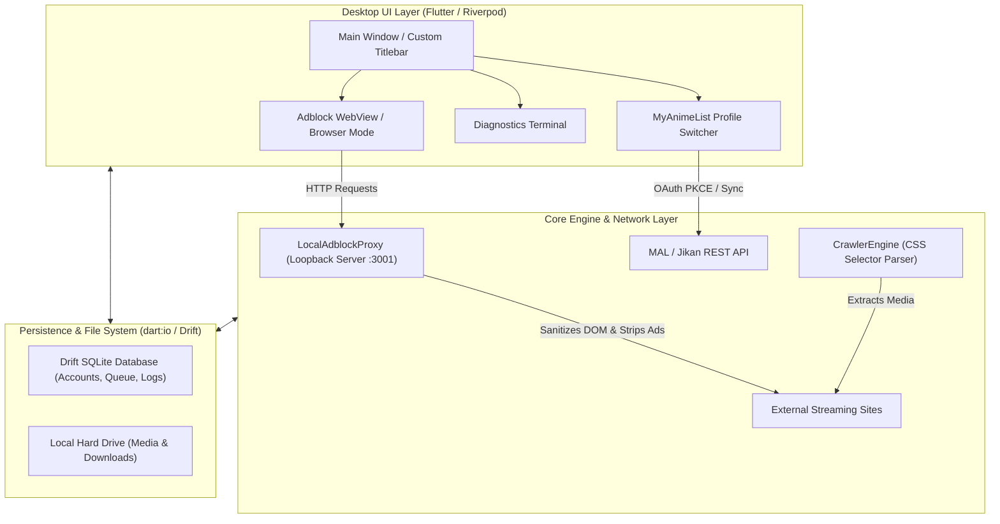

# 🌸 Komorebi (木漏れ日)

**An All-in-One Native Flutter Desktop Application for Consuming, Archiving, and Synchronizing Manga & Anime from
MyAnimeList.**


---

## 📌 Overview

**Komorebi** is a powerful, standalone application built with Flutter, tailored specifically for **Windows** desktop and
**Web** platforms. Designed as an evolution of web-frontend and Node-backend media synchronizers, Komorebi eliminates
the need to run external local backend servers or browser extensions. Everything runs within a high-performance unified
binary or responsive web environment.

Whether you are synchronizing your watching progress with **MyAnimeList (MAL)**, browsing streaming archives ad-free via
our embedded loopback proxy, or downloading high-bitrate media directly to your hard drive, Komorebi delivers a
seamless, premium experience.

---

## ✨ Key Features

- 🖥️ **Native Desktop Architecture**: Powered by Flutter and `window_manager`, offering custom window dimensions,
  borderless layouts, drag-handling, and native system OS integration.
- ⚡ **Zero Local Host Requirement**: Eliminates external Node.js servers. Leveraging Dart's native `dart:io`, Komorebi
  directly reads and writes files to your system without browser sandbox restrictions.
- 🛡️ **Embedded Adblock Loopback Proxy**: Features an internal HTTP loopback server (`LocalAdblockProxy`) running on
  port `3001` that intercepts requests, strips tracking scripts, removes ad banners, and purges unwanted popups/iframes
  before serving HTML to inline web views.
- 💾 **Relational SQLite Persistence (Drift)**: A robust, type-safe SQLite database layer replacing traditional JSON file
  persistence. Seamlessly manages user profiles, multi-account switching, download queues, application configurations,
  and audit logs.
- 🕷️ **HTML Scraper & Crawler Engine**: Built-in CSS selector extraction engine (`CrawlerEngine`) powered by
  `package:html` and `dio` to traverse media directories and extract streaming or download links.
- 🌗 **Curated Obsidian Aesthetic**: Designed with a sleek, dark/light monochrome visual identity using premium
  typography (**Inter**, **JetBrains Mono**, and **Playfair Display**).
- 📊 **Real-Time Diagnostics Terminal**: Integrated audit logging and debugging console powered by `talker` for instant
  developer feedback.

---

## 🏗️ Architecture & Data Flow



---

## 🛠️ Technology Stack

| Feature                    | Dart / Flutter Package                     | Purpose                                                                       |
|:---------------------------|:-------------------------------------------|:------------------------------------------------------------------------------|
| **State Management**       | `flutter_riverpod` (^3.3.2)                | Reactive separation of business logic, download states, and UI.               |
| **Database & Persistence** | `drift` (^2.34.0) + `sqlite3_flutter_libs` | Type-safe relational SQLite database for accounts, queues, logs, and config.  |
| **REST & Networking**      | `dio`                                      | High-performance HTTP client with download progress streams and interceptors. |
| **HTML Parser & Scraper**  | `html` (^0.15.6)                           | DOM traversal and CSS selector querying engine.                               |
| **Adblock Proxy Server**   | `dart:io` (`HttpServer`)                   | Embedded loopback server to fetch, sanitize, and proxy streaming sites.       |
| **Window Management**      | `window_manager` (^0.5.1)                  | Custom title bars, window framing, centering, and size constraints.           |
| **Logging & Diagnostics**  | `talker` (^5.1.17)                         | Advanced structured logging and pre-built visual console view.                |
| **Localization**           | `flutter_intl` + `intl`                    | ARB-based multi-language support and deferred loading.                        |

---

## 📈 Development Progress Dashboard

| Phase | Title                                 |       Status       | Progress | Key Implemented Components                                                                    |
|:-----:|:--------------------------------------|:------------------:|:--------:|:----------------------------------------------------------------------------------------------|
| **1** | **Bootstrap & Window Controls**       |  🟢 **Completed**  |   100%   | Project setup, `window_manager` initialization, monochrome obsidian theme.                    |
| **2** | **Local Database (Drift SQLite)**     | 🟡 **In Progress** |   75%    | `AppDatabase` setup, schemas (`Accounts`, `QueueItems`, `Logs`, `Config`), generated queries. |
| **3** | **MAL Sync & PKCE Auth**              | ⚪ **Not Started**  |    0%    | Pending Jikan client & OAuth deep-linking.                                                    |
| **4** | **Scraper & HTML Parsing Engine**     | 🟡 **In Progress** |   33%    | `CrawlerEngine` DOM and CSS selector extractor implemented.                                   |
| **5** | **Adblock Proxy & Sandboxed WebView** | 🟡 **In Progress** |   80%    | Embedded `LocalAdblockProxy` loopback HTTP server & HTML sanitizer implemented.               |
| **6** | **Downloader & Queue Worker**         | ⚪ **Not Started**  |    0%    | Pending background queue scheduler and real-time progress tracking.                           |
| **7** | **Offline Media Kit Player**          | ⚪ **Not Started**  |    0%    | Pending `media_kit` MPV hardware-accelerated video player integration.                        |
| **8** | **Diagnostics Terminal & Polish**     | 🟡 **In Progress** |   20%    | Integrated `talker` logger instance in application root.                                      |

---

## 🚀 Getting Started

### Prerequisites

- **Dart SDK**: Version `^3.12.2` or higher
- **Flutter SDK**: Version `^3.24.0` or higher (compatible with Dart 3.12+)
- **Platform Development Tools**:
    - **Windows**: Visual Studio 2022 with C++ Desktop Development workload
    - **Web**: Google Chrome, Microsoft Edge, or any modern web browser

### Installation & Build

1. **Clone the repository**:
   ```bash
   git clone https://github.com/p2kr/komorebi.git
   cd komorebi
   ```

2. **Install Flutter dependencies**:
   ```bash
   flutter pub get
   ```

3. **Run Code Generation** *(required for Drift database & localization)*:
   ```bash
   # Generate Drift database schemas
   dart run build_runner build --delete-conflicting-outputs

   # Generate localization (intl) files
   dart run intl_utils:generate
   ```

4. **Run the application**:
   ```bash
   # For Windows Desktop
   flutter run -d windows

   # For Web
   flutter run -d chrome
   ```

---

## 📁 Project Structure

```text
lib/
├── crawlers/          # HTML parsing engines and DOM scraper logic (crawler_engine.dart)
├── intl/              # ARB localization files and generated localization classes
├── models/            # Drift SQLite table schemas and generated database code
├── network/           # Embedded HTTP loopback proxy server (proxy_server.dart)
├── providers/         # Riverpod state providers and account management
├── screens/           # UI screens (Home, Browser Mode, My List, Local Collection)
├── services/          # Data Access Objects (DAO) and backend services
├── themes/            # Monochrome obsidian theme definitions and typography
├── utils/             # Constants, window initialization, and Talker diagnostics
└── main.dart          # Application entry point and ProviderScope bootstrap
```

---

## 📖 Documentation & References

For comprehensive engineering details, architectural blueprints, and migration guidelines from the legacy web stack,
explore our internal documentation:

- 🗺️ **[roadmap.md](file:///c:/Users/Prince/Documents/CODE/mal_viewer/docs/roadmap.md)**: Full Phase-by-Phase technical
  transition plan, code mapping, and schema blueprints.
- 📝 **[react_instructions.md](file:///c:/Users/Prince/Documents/CODE/mal_viewer/docs/react_instructions.md)**: Developer
  handover documentation detailing the original React/Express architecture and features.

---

## 📄 License

This project is licensed under the **MIT License** - see
the [LICENSE](file:///c:/Users/Prince/Documents/CODE/mal_viewer/LICENSE) file for details.

