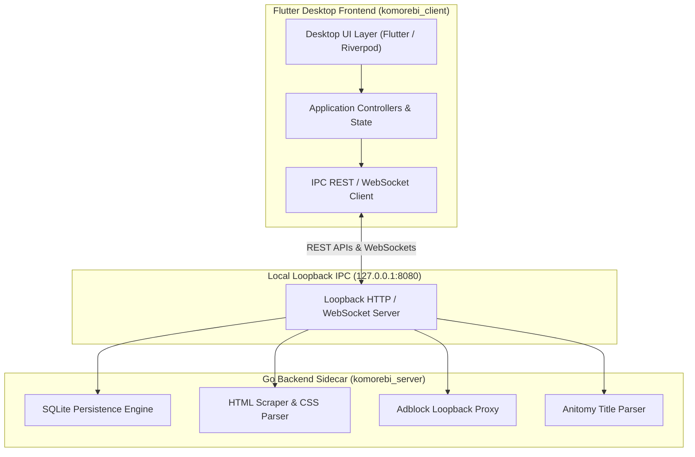

# 🌸 Komorebi (木漏れ日)

**An All-in-One Native Desktop Client & Local Sidecar Engine for Consuming, Archiving, and Synchronizing Manga & Anime from MyAnimeList / AniList.**


[](https://codecov.io/gh/p2kr/komorebi)


---

## 📌 Overview

**Komorebi** is a powerful desktop application tailored specifically for **Windows** and **Linux** platforms. Built using a decoupled architecture, Komorebi pairs a high-performance **Flutter Desktop Client (`komorebi_client`)** with a dedicated **Go Local Backend Sidecar (`komorebi_server`)**.

The Flutter client delivers a reactive user experience adhering to Feature-First Clean Architecture, while the Go backend sidecar manages local database persistence, HTML scraping, torrent downloading, title parsing, and local adblock proxying over local loopback (`http://127.0.0.1:8080`).

---

## ✨ Key Features

- 🖥️ **Native Desktop Architecture**: Powered by Flutter (`komorebi_client`) and Go (`komorebi_server`), offering borderless layouts, drag-handling, and OS integration.
- ⚡ **Local Backend Sidecar**: High-performance Go sidecar process automatically managed by the Flutter client over local loopback IPC.
- 🔑 **OAuth 2.0 PKCE & Deep Linking**: Native deep-linking integration (`komorebi://auth-callback`) and PKCE flow for 1-click MyAnimeList/AniList authentication.
- 🛡️ **Embedded Adblock Loopback Proxy**: Local HTTP loopback server that intercepts requests, strips tracking scripts, and sanitizes HTML before serving web views.
- 💾 **Local Relational SQLite Persistence**: SQLite database layer managing user profiles (`Profiles`), download queues (`QueueItems`), audit logs (`Logs`), and app configuration (`Configs`).
- 🕷️ **HTML Scraper & Crawler Engine**: Built-in CSS selector extraction engine to traverse media trackers and parse streaming/download links.
- 🌗 **Curated Obsidian Aesthetic**: Designed with a sleek monochrome visual identity using premium typography (**Inter**, **JetBrains Mono**, **Playfair Display**).
- 📊 **Real-Time Diagnostics Terminal**: Integrated audit logging console powered by `talker` with level and category filters.

---

## 🏗️ Architecture & Data Flow


```mermaid
graph TD
    subgraph Client["Flutter Desktop Frontend (komorebi_client)"]
        UI["Desktop UI Layer (Flutter / Riverpod)"]
        State["Application Controllers & State"]
        DioClient["IPC REST / WebSocket Client"]
        UI --> State --> DioClient
    end

    subgraph IPC["Local Loopback IPC (127.0.0.1:8080)"]
        DioClient <-->|REST APIs & WebSockets| Sidecar
    end

    subgraph Server["Go Backend Sidecar (komorebi_server)"]
        Sidecar["Loopback HTTP / WebSocket Server"]
        DB["SQLite Persistence Engine"]
        Crawler["HTML Scraper & CSS Parser"]
        Proxy["Adblock Loopback Proxy"]
        Parser["Anitomy Title Parser"]
        
        Sidecar --> DB
        Sidecar --> Crawler
        Sidecar --> Proxy
        Sidecar --> Parser
    end
```

---

## 🛠️ Technology Stack

| Component | Framework / Package | Purpose |
|:---|:---|:---|
| **Frontend UI** | Flutter (^3.24) + Riverpod (^3.3.2) | Feature-First reactive desktop user interface. |
| **Backend Sidecar** | Go (1.22+) | Standalone lightweight local API server and heavy worker engine. |
| **REST & Networking** | `dio` (^5.10.0) | High-performance HTTP client connecting Flutter to local sidecar. |
| **OAuth 2.0 & Deep Links** | `protocol_handler` + `app_links` | URI scheme handling (`komorebi://auth-callback`) & PKCE token flow. |
| **Database Persistence** | SQLite (GORM / sqlc in Go) | Relational local storage for profiles, queue items, logs, and configs. |
| **Window Management** | `window_manager` (^0.5.1) | Custom title bars, framing, centering, and size constraints. |
| **Logging & Diagnostics** | `talker` (^5.1.17) | Structured logging engine and visual diagnostic window. |

---

## 🚀 Getting Started

### Prerequisites

- **Dart SDK**: Version `^3.12.2` or higher
- **Flutter SDK**: Version `^3.24.0` or higher
- **Go SDK**: Version `1.22` or higher (for backend sidecar compilation)

### Installation & Execution

1. **Clone the repository**:
   ```bash
   git clone https://github.com/p2kr/komorebi.git
   cd komorebi
   ```

2. **Run the Flutter Client**:
   ```bash
   cd komorebi_client
   flutter pub get
   flutter run -d windows   # Or: flutter run -d linux
   ```

3. **Run the Go Backend Sidecar (Standalone / Dev Mode)**:
   ```bash
   cd komorebi_server
   go run main.go
   ```

---

## 📁 Repository Structure

```text
mal_viewer/ (Root)
├── docs/                        # Engineering blueprints & architecture reviews
│   ├── Komorebi Flutter Code Architecture Review and Refactoring.md
│   ├── roadmap.md
│   └── test_plan.md
│
├── komorebi_client/             # Feature-First Flutter Desktop App
│   ├── assets/
│   ├── lib/
│   │   ├── main.dart
│   │   └── src/
│   │       ├── core/            # Themes, utilities, network, services, crawlers
│   │       ├── features/        # appbar, browser_mode, crawlers, dashboard, discover, settings, etc.
│   │       ├── models/          # Data Transfer Objects & schemas
│   │       ├── providers/       # Riverpod state management
│   │       └── shared/          # Reusable UI widgets
│   ├── test/
│   └── pubspec.yaml
│
└── komorebi_server/             # Go Local Backend Sidecar
    ├── go.mod
    ├── main.go                  # Sidecar loopback entry point
    └── internal/
        ├── crawler/             # HTML scraper engine & CSS selector parser
        ├── db/                  # SQLite database engine
        ├── parser/              # Title string parser
        └── proxy/               # Adblock loopback proxy & sanitizer
```

---

## 📖 Documentation & Architecture References

For detailed architectural blueprints and refactoring specifications:

- 🏗️ **[Architecture Review & Refactoring Blueprint](file:///c:/Users/Prince/Documents/CODE/mal_viewer/docs/Komorebi%20Flutter%20Code%20Architecture%20Review%20and%20Refactoring.md)**: Feature-First Clean Architecture and frontend/backend split specification.
- 🗺️ **[roadmap.md](file:///c:/Users/Prince/Documents/CODE/mal_viewer/docs/roadmap.md)**: Phase-by-Phase implementation roadmap.
- 🧪 **[test_plan.md](file:///c:/Users/Prince/Documents/CODE/mal_viewer/docs/test_plan.md)**: Testing & quality assurance matrix.

---

## 📄 License

This project is licensed under the **GNU Affero General Public License v3.0 (AGPL-3.0)** - see the [LICENSE](file:///c:/Users/Prince/Documents/CODE/mal_viewer/LICENSE) file for details.
